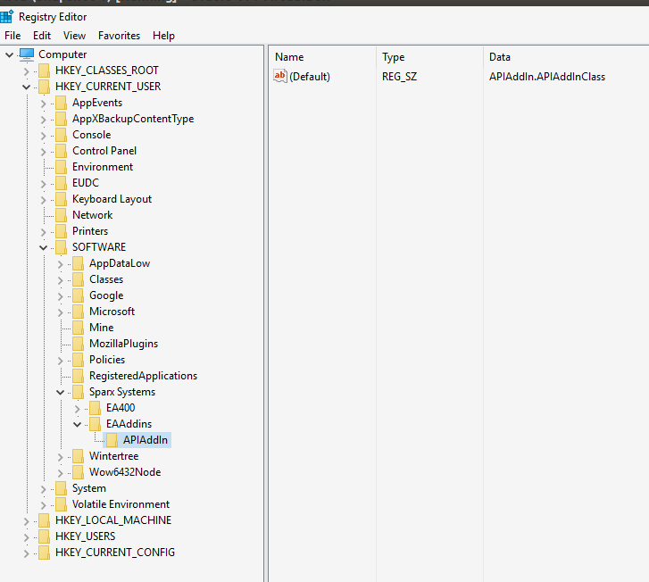

# APIAddIn

An Add In to Sparx Enterprise Architect to allows modelling and exporting of RAML,Json Schema and Json artefacts.

Blogs about this functionality
 - [Modelling an API in SparxEA and building runtime artefacts](https://xceptionale.wordpress.com/2016/03/09/modelling-an-api-in-sparkea-and-building-runtime-artefacts/)
 - [Editing Samples and Updating the Enterprise Architect Model](https://xceptionale.wordpress.com/2016/02/21/editing-samples-and-updating-the-enterprise-architect-model/)
 - [Generating Object Diagram Samples from UML Class Models](https://xceptionale.wordpress.com/2016/02/21/generating-object-diagram-samples-from-uml-class-models/)
 - [Modelling API Schema as Class Diagrams in Enterprise Architect](https://xceptionale.wordpress.com/2016/02/21/modelling-api-schema-as-class-diagrams-in-enterprise-architect/)

Videos introducing this functionality.  
- [Introduction](https://www.youtube.com/watch?v=uzPYato5kCk)
- [Exporting class diagrams as json schemas](https://www.youtube.com/watch?v=FKTzZ6ObkGo)
- [Generating samples](https://www.youtube.com/watch?v=A0gYgGENT6U)
- [Synchronizing Json files into EA](https://www.youtube.com/watch?v=RnohxHbeX4w)
- Validating RAML API,Json Schemas and Samples (no video as yet)

# Installation

- Build the solution in the APIAddIn folder using visual studio
- Using Regedit add the registry key to list Sparx EA to the class.

- Start EA.
- You should see the extension menus in Extensions-API MDG.
  -   The extensions are context sensitive

# Using this add in

 - [Use](./Using.md)

# Thanks
  This project makes use of the [Yaml.NET](https://github.com/aaubry/YamlDotNet). I have had to clone the source code into this project as without changes I couldnt get the raml syntax to be generated correctly.

  This project also reliese upon the [SVG Export](http://community.sparxsystems.com/community-resources/706-svg-diagram-export-add-in).
  Please install this plugin.

# Useful

If this is useful to you or you would be interested to some other features/capabilities. Let me know.
