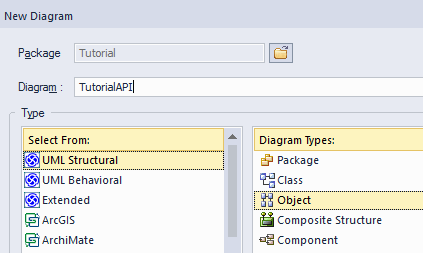
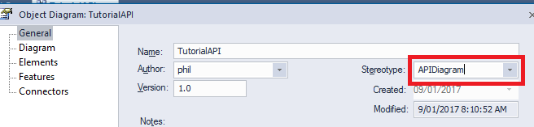
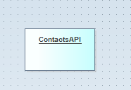
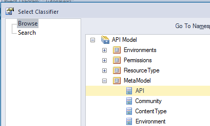
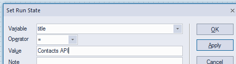
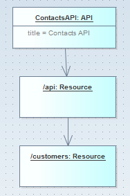
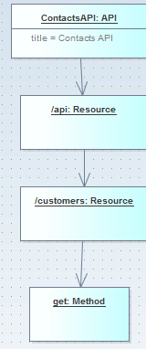
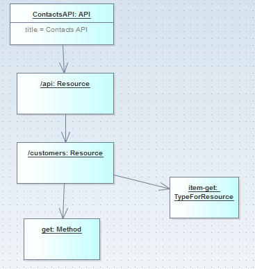
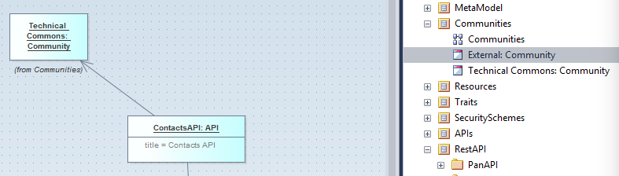
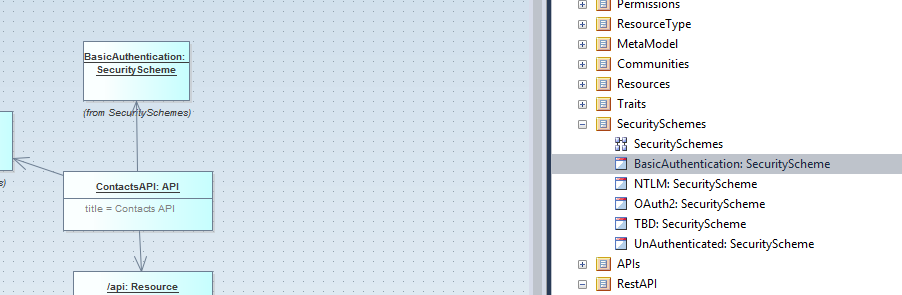

# Tutorial

In this tutorial you will create an API with a single GET REST method, a schema for the response and a sample for the response. You will export the RAML, the JSON schema and the JSON sample.

In this tutorial the API we are modelling is expected to return a list of contacts. It will be the Contacts API.

# Object the Example.EAP

The add in depends upon a meta model which is modeled in the Example.EAP.
Open the Example.EAP file.
See the API Model/MetaModel package which has the meta model diagram.

# Create the API diagram and object

Create a new package in any location.

Create an 'object' diagram in the package. Its name can be anything and doesnt related to any of the generated output.  For the purpose of this tutorial this diagram will be called the 'Contacts API Diagram'

Edit the properties of the diagram and set the stereotype to be 'APIDiagram'

Create an 'Object' from the pallette onto the diagram. This object will represent the API.  Give it a name of your API. e.g. Contacts API.

Classify the object as the 'API' element in the metamodel. (short cut is ctl-l)

Edit the 'Run State' of the object and set the title for the API.(short cut is ctl-shift-r)

You can also choose to set the media type ,version and other properties.  (The set comes from the attributes of the API meta model class.)

Now export the diagram and observe where the API file is written to.  With the Contacts API Diagram selected, choose 'Extensions/API MDG/Export API'

The export process will write details where the raml file is being generated to in the system output window.

Open the file and have a look at the content which should be as per the following.
~~~
#%RAML 0.8
title: Contacts API
baseUri: https://{environment}
baseUriParameters:
  environment:
    enum: [ ]
documentation:
- title: Description
  content: ''
- title: History
  content: !include documentation/history.md
- title: Effort
  content: !include documentation/effort.md
traits: !include traits.raml
schemas:
- infoSchema: !include schemas/ErrorResponse.json
~~~
The generated raml includes references to standard markdown, schema and traits files.

# Create the REST resources

Now we will add REST resources to the API.

Create an 'object' from the pallette on the diagram.  This object will represent a Resource.  Give it a value of a resource path fragment '/api'

Classify the object as the 'Resource' element in the metamodel. (short cut is ctl-l)

Do these 2 steps again to create a resource with path '/customers'

Then create a directed assocation from the API object to the api object and a second directed relationship from the api object to the customers object.

The diagram should look like the following.

Again export the API and see how the raml file now differs.

If you open the file you should notice that the following content representing the REST resources has been added.
~~~
/api:
  uriParameters: {}
  /customers:
    uriParameters: {}
~~~

# Create a method

Now we will add a method to the API.

Create an 'object' from the pallette on the diagram.  This object will represent the Method.  Give it a value of a resource path fragment 'get'. Also provide a description in the object of 'Retrieves all customers'

Classify the object as the 'METHOD' element in the metamodel.

Then create a directed assocation from the '/customers' Resource to the get method object.  

The diagram should now look like this.

Again export the API and see how the raml file now differs.

The following content representing the GET method has been added.
~~~
/api:
  uriParameters: {}
  /customers:
    uriParameters: {}
    get:
      description: Retrieves all customers
~~~

# Create the resource type

Now we will associate the /customers resource with an 'item-get' Resource Type.  Please refer to the RAML documentation to understand what a RAML Resource Type is for.

Create an 'object' from the pallette on the diagram.  This object will represent the ResourceType.  Give it a value of a resource path fragment 'item-get'.

Classify the object as the 'TypeForResource' element in the metamodel.

Then create a directed assocation from the '/customers' Resource to the item-get resource type object.  

The diagram should now look like this.

Again generate the raml and you will see the type: map has been added to the raml.
~~~
/api:
  uriParameters: {}
  /customers:
    uriParameters: {}
    type:
      item-get:
        infoSchema: infoSchema
        sample400Resp: !include samples/sample400BadRequest-sample.json
        sample401Resp: !include samples/sample401-Unauthorized-sample.json
        sample403Resp: !include samples/sample403-Forbidden-sample.json
        sample404Resp: !include samples/sample404Resp-sample.json
        sample405Resp: !include samples/sample405-MethodNotAllowed-sample.json
        sample406Resp: !include samples/sample406-NotAcceptable-sample.json
    get:
      description: Retrieves all customers
~~~

The generate 'item-get' type references a number of standard samples.  You will find all these in the PanAPI directory.  The intention is they are common across all APIs.

The 'item-get' type is a
lso going to come from the PanAPI.
Look in the PanAPI/src/main/api/ directory. You will see a couple resource-type raml files.  In these common files we can define the types of resources we will use in our apis.  

# Add the Community

We will now add a Community to the diagram which will bring in a reference to the 'family' of APIs we are working with.
Open the Communities package and bring in a link to one of the community elements.  Then create a directed link from the API element to the community element.

The diagram should now look like this.

Export the api again. The difference will be the addition of this line which is a reference to the resource-type file.
~~~
resourceTypes: !include resource-types-mom.raml
~~~

You will see in the Community element that the version attribute contains the value 'resource-types-mom' which is expanded into a full include reference during the api export.

# Add the Security Scheme

Similar to community we link in a security scheme.
The diagram should now look like this.

Export the api again. The difference will be the addition of this line which is a reference to the resource-type file.
~~~
securitySchemes: !include security-schemas-basic.raml.raml
~~~

# Next steps - Coming Soon

Link in the schema
Link in samples
Link the resource type to the samples and schema.

(See the other sample APIs in the RestAPI/TechnicalCommonsAPI package)
