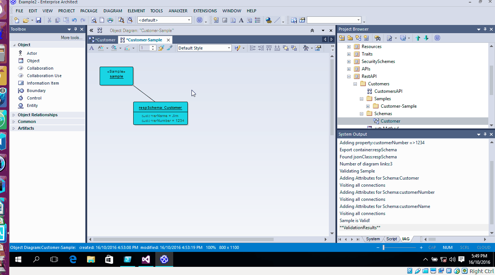
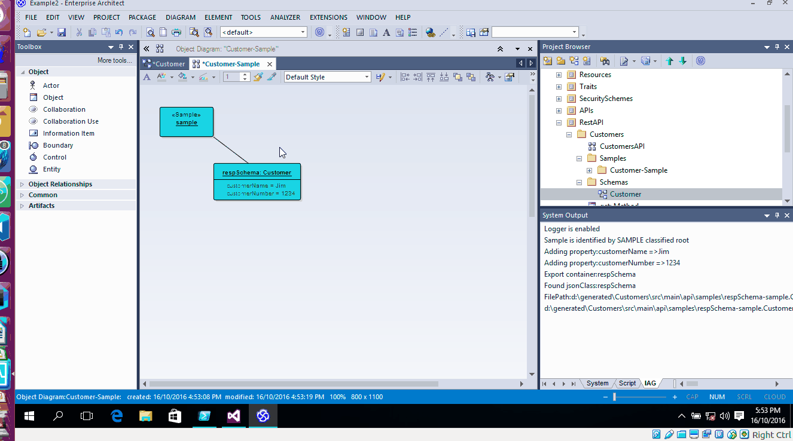
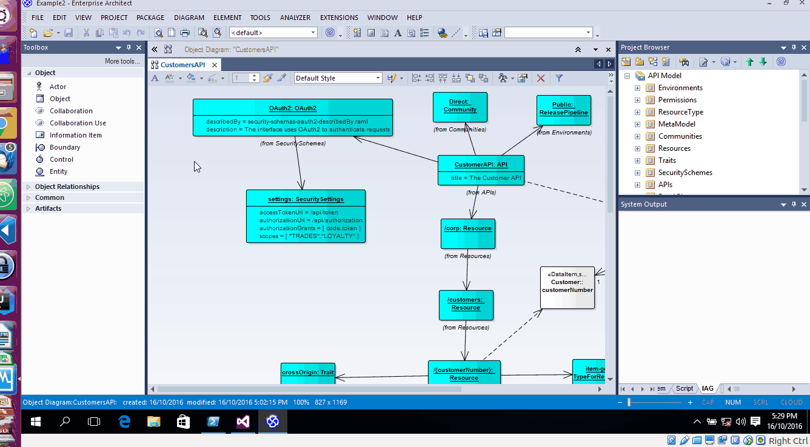
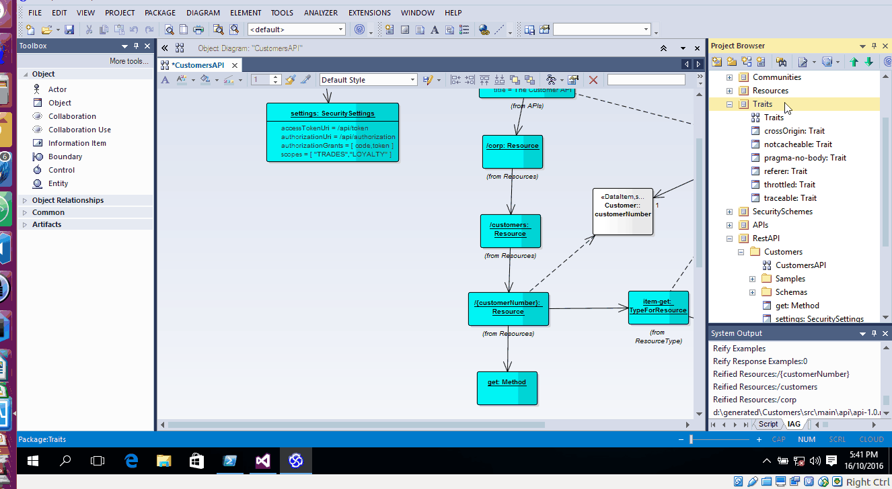
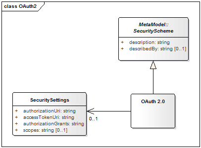
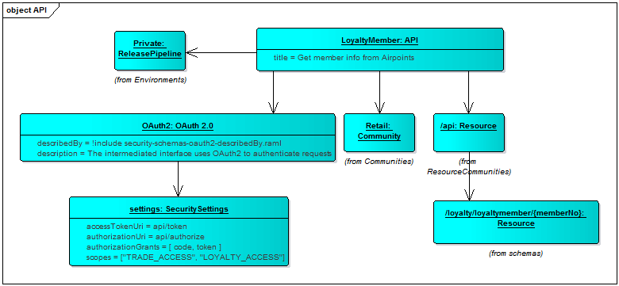

# Using the API Add In

# Validating a sample

When viewing a sample, use the validate sample to check it conforms to the schema.

# Sync a sample from the file system

Update a sample outside of EA and bring the content into the sample.

# Raml 1.0

There is now an 'Export RAML 1.0' menu option.

This will export a raml 1.0 formatted raml file.

~~~~
#%RAML 1.0
title: The Customer API
baseUri: https://{environment}
baseUriParameters:
  environment:
    enum: [api.test.corp.com,api.live.corp.com]
uses:
  extensions: annotations.1_0.raml
documentation:
- title: Description
  content: ''
- title: History
  content: !include documentation/history.md
- title: Effort
  content: !include documentation/effort.md
traits: !include traits.1_0.raml
resourceTypes: !include resource-types-direct.1_0.raml
~~~~

# Linking traits to methods

Link traits to methods to get them included in the raml

~~~~
/{customerNumber}:  
  get:    
    is: [crossOrigin,notcacheable,traceable]
~~~~

## OAuth2 with scopes

An OAuth2 security schema with scopes can be configured using the OAuth2 meta class

You would use this in the api definition in the following way.

The following is added to the RAML.
~~~~
securitySchemes:
- OAuth2:
    type: OAuth2
    describedBy: security-schemas-oauth2-describedBy.raml
    description: The interface uses OAuth2 to authenticate requests
    settings:
      accessTokenUri: /api/token
      authorizationUri: /api/authorization
      authorizationGrants: [ code,token ]
      scopes: [ "TRADES","LOYALTY" ]
~~~~
